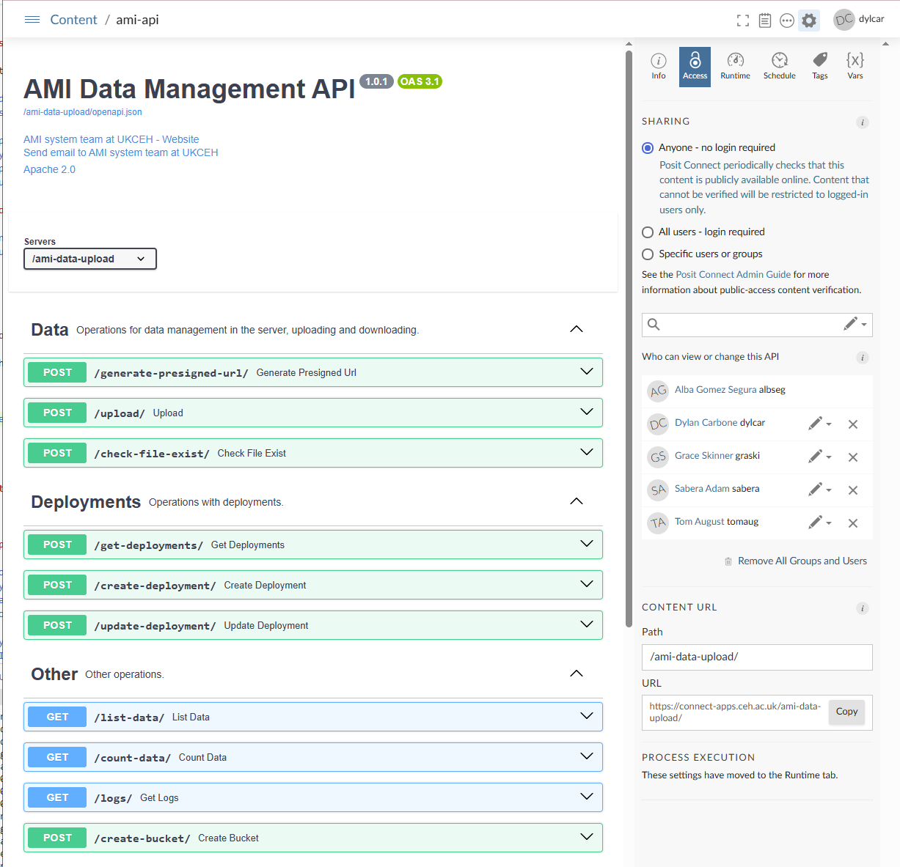
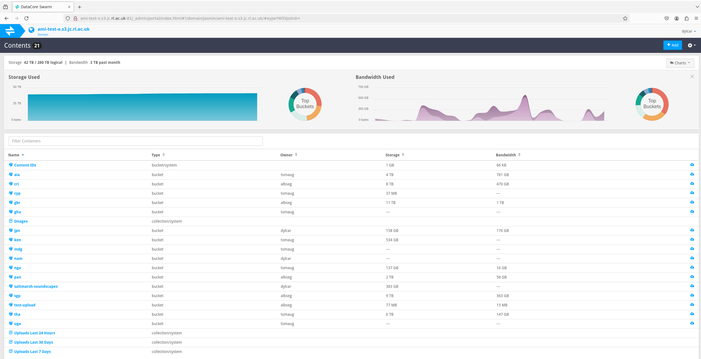

# Data Management API and general object store management readme

This document serves two purposes:

1. A readme for developers and survey partners explaining how to use the AMI Data Management API.
2. A transfer guide describing the current setup, processes, and next steps for anyone taking over maintenance.

## Setup

If you would like access to the object store, it is required that you have access to the following services:

- Login Services: This provides access to the JASMIN shared services, i.e. login, transfer, scientific analysis servers, Jupyter notebook and LOTUS.
- Object Store: This is the data object store tenancy for the Automated Monitoring of Insects Trap. It currently stores all data we and our partners collect from the field.

The [JASMIN documentation](https://help.jasmin.ac.uk/docs/getting-started/get-started-with-jasmin/) provides useful information on how to get set-up with these services. Including:
1. [Generate an SSH key](https://help.jasmin.ac.uk/docs/getting-started/generate-ssh-key-pair/)
2. [Getting a JASMIN portal account](https://help.jasmin.ac.uk/docs/getting-started/get-jasmin-portal-account/)
3. [Request “jasmin-login” access](https://help.jasmin.ac.uk/docs/getting-started/get-login-account/) (access to the shared JASMIN servers and the LOTUS batch cluster)

To access the object store requires a credentials file. You can request one from one of the current managers or users. If you are a maintainer, you should request user permission from the manager, [Tom August](https://accounts.jasmin.ac.uk/services/object_store/ami-test-o/)

If you are a UKCEH staff member, you may want access to MobaXterm, which provides user-friendly interface from which to SSH into JASMIN. It also has a useful file management panel. Please contact IT about this and they will install it for you.

## Context

Data that is recorded by automated monitoring systems including the LepiSense and Automated Monitoring of Insects (AMI) system needs to be collected and stored inside a single location that is accessible to High Performance Computing (HPC) Clusters for inferencing. For the AMI and LepiSense systems, all storage and HPC services are currently provided by JASMIN, hence the previous setup stages.

For more information on the inferencing steps, please take a look at the readme inside the amber-inferences repo [here](https://github.com/AMI-system/amber-inferences/blob/main/README.md). if you have not read it, I'd recommend looking at it after reading this document.

### Object store structure

For the storage, the data collected by these systems is uploaded to `buckets` (S3-style storage containers) inside a JASMIN storage tennancy. Currently, we have 280 terrabytes of space - of which, about 42 terrabytes is used - allocated for use up until the 31st of March 2027. The buckets are used to partition the data between survey countries and are named after the the lowercase ISO-3 code associated with the country name you can find corresponding ISO-3 codes for countries [here](https://www.iban.com/country-codes). For example, our current largest bucket is the bucket for the United Kingdom of Great Britain and Northern Ireland, `gbr`, whilst data collected from Panama are stored inside the bucket, `pan`. Occasionally projects have unique buckets and have a name associated with the bucket. The only example of this currently is the `saltmarsh-soundscapes` bucket.

Inside buckets, files follow a standard structure:

```
DEPLOYMENT_ID / DATA_TYPE / FILENAME
```

* **Deployment ID**: The ID associated with the deployment. Please note that some regions such as Panama will have multiple years of surveys. This is either a single value or a vector of values, one for each file (if you want to download files across multiple deployments). Please be careful and make sure you are referencing the correct deployment by reviewing the latitude and longitude information carefully.
* **Data type**: either `snapshot_images`, `motion_images` (for older surveys), `audible_recordings`, `ultrasound_recordings`, or for Saltmarsh: `terrestrial_recordings` and `aquatic_recordings`.
* **Filename**: the actual image/audio file name. The filename will contain a timestamp.

Deployments are IDs associated with the placement of a monitoring system at a location. We define deployment as a long, continous period of monitoring (on the scale of weeks or months) at a location by a single AMI/LepiSense system. Multiple systems must always be allocated different deployment IDs, no matter how close they are as this will create later file upload conflicts. Likewise deployments should be separated by monitoring season. I.E., if a single site is monitored over two distinct survey periods, they should be treated as separate deployments. This should be adhered to to ensure that metadata related to the hardware configuration is recorded. Important mentions are sites like Panama which have 3 distinct periods of monitoring of varying time spans. Whenever you are uploading or downloading data, please be careful and make sure you are referencing the correct deployment by reviewing the latitude and longitude information carefully.

### Deployment metadata

Deployments and their metadata are stored inside the `deployments_info.csv` file. If you open this file, you will see entries for deployments and their associated metadata. In the metadata you will see some fields we have covered such as the bucket name (called `country_code`) and `deployment_id`. You also have the following fields:

* location_name: This is the readable location name associated with the deployment that allows you to interpret where the system was deployed without having to look up the location based on the latitude and longitude coordinates. It similarly allows partners to distinguish their deployments inside the uploader interface.

*Note: If you have not uploaded files before, please consult the `object-store-scripts` respository here for scripts that will allow you and partners to upload data to the object store. For a user-friendly guide on uploading files with pictures of the upload process (as well as a document that can be shared with the partners), please consult the partners guide for uploading data [here](https://cehacuk.sharepoint.com/:f:/r/sites/UKCEHEasyRIDER/Shared%20Documents/General/Manual/data_upload_guide_and_script/partners?csf=1&web=1&e=7p2evy)*

* lat & lon: The latitude-longitude positions of the system deployments.
* location_id: An ID associated with the position of the AMI system deployment. This ID is now defunct and should be removed.
* camera_id: The unique ID of the AMI system camera. The camera ID has previously been used as a tracker for unique system ID (a proxy for system ID). This was used because you do not need to pre-assign system ID's, it is already hardcoded in. However, cameras are occasionally switched between systems without record. Therefore the system ID should be adopted over camera_ID
* system_id: The unique ID of the AMI system. This metadata field will be most useful to model unique system behaviours as a result of differences in software, components, and errosion whilst in the field (e.g., water leekage affecting camera blur)
* hardware_id: A unique ID of the AMI system assigned to the combination of hardware components. You can use the table below. Currently recording of the hardware IDs are partial, and one of the needed tasks is to update the deployment metadata with the latest hardeware IDs.

| Hardware ID  | Attractant light | Camera        | Lights around the camera | Microphone   | Deployments             |
| ------------ | ---------------- | ------------- | ------------------------ | ------------ | ----------------------- |
| 1            | Actinic tube     | Logitech Brio | LEDs                     | NA           |                         |
| 2            | Actinic tube     | Logitech Brio | LEDs                     | SM4          | Argentina               |
| 3            | LepiLED          | Logitech Brio | LEDs                     | NA           | Ag0+, Panama            |
| 4            | LepiLED          | Logitech Brio | LEDs                     | SM4 & SM4BAT | Natural England         |
| 5            | LepiLED          | Logitech Brio | PCB LED                  | SM4 & SM4BAT | Panama, Costa Rica, SWT |
| 6            | LepiLED          | Logitech Brio | PCB LED                  | Audiomoth    | AgZero+ 2024            |
| 7            | LepiLED          | Logitech Brio | PCB LED                  |              | UCL                     |


* status: Whether the deployment is `active` or `inactive`. If `inactive`, the deployment is not listed as available for the user to upload files to. It is important to update deployments as `inactive` when surveying is complete and files have been uploaded to ensure that users doing a second season of surveying do not upload to registered deployments for the first season of surveying. This happened with the Surrvey wildlife Trust and needs to be resolved.

### The role of the API

This API is a FastAPI service that gives controlled, auditable access to the AMI object‑store tenancy. It sits between user machines and the S3‑compatible object store so that survey partners can upload data without ever seeing long‑lived object‑store credentials that are dangerous if misused. The API works by generating short lived `presigned URLs` that allow files to be uploaded securely. Additionally, the API maintains the live list of deployments and their metadata highlighted in the previous sections that the partners interact with during their uploads.

## 3. How the API Works

The interactive upload [guide](https://cehacuk.sharepoint.com/:w:/r/sites/UKCEHEasyRIDER/Shared%20Documents/General/Manual/data_upload_guide_and_script/partners/AMI%20survey%20data%20upload%20guide%2011-06-2025.docx?d=w3f5cae9dde2649eeb1b812c8cbf699d0&csf=1&web=1&e=SBo7JC) better illustrates the process, but the upload script asks the survey partner to provide the API username (aimappuser) and password (Osd7r0I9hkFWLY0Eqoia). After passing authentication, it asks them who they are, what bucket they wish to upload to, what deployment they want to upload to, the data type of files they wish to upload, and their local path to these files.

After the user authorises the upload, the API checks which files already exist in the object store, requests `presigned URLs` (temporary, single‑use upload links that expire after 1 hour), and uploads files directly to the object store by `PUT`‑ing file bytes to those URLs. Note, the API never handles the file bytes itself, it only issues the permission token (the presigned URL).

The API provides this funcitonality using endpoints, `/get-deployments/`, `/check-file-exist/`, and `/generate-presigned-url/`.

### Authentication

Every protected API call includes two form fields: `username` and `password`. The server checks these on every request; if they don’t match what the API expects, you get a 401 (Unauthorized) response and nothing else happens. In practice, the upload script reads the partner’s credentials once (e.g., from environment variables or a prompt) and reuses them for all subsequent requests. The API username and password is stored inside the credentials JSON file.

### Retreiving deployments and summarising them for the user

Before any uploads, the script asks the API for the live list of deployments. This list contains the deployment ID, country code, site name and camera ID. The script then displays a simple summary so the uploader can pick the right bucket and deployment\_id. Subsequently, the script asks the user to select the data type, from which the file extension is inferred.

Upload script sending a request to the `get-deployments` endpoint....

```python
def get_deployments():
    """Fetch deployments from the API with authentication."""
    try:
        url = "https://connect-apps.ceh.ac.uk/ami-data-upload/get-deployments/"
        data = {
            "username": GLOBAL_USERNAME,
            "password": GLOBAL_PASSWORD
        }
        response = requests.post(url, data=data, timeout=600)

```

The API returning the deployments info

```python
def load_deployments_info():
    deployments = []
    with open('deployments_info.csv', newline='', encoding='utf-8-sig') as csvfile:
        reader = csv.DictReader(csvfile)
        for row in reader:
            deployments.append(row)
    return deployments

deployments_info = load_deployments_info()

@app.post("/get-deployments/", tags=["Deployments"])
async def get_deployments(username: str = Depends(validate_credentials)):
    return JSONResponse(content=deployments_info)

```

### Checking file existance with concatenated file names

To avoid re-uploading files that are already in the object store, the script uses the batched existence-check endpoint. Instead of sending a separate request for each filename, it sends one request with a comma-separated list of filenames in the `filenames` form field, along with `country` (bucket), `deployment` (deployment\_id), and `data_type`. The API responds with a dictionary mapping each filename to `true/false`. The script filters out any files that already exist and proceeds only with the ones marked `false`.

The upload script sending concatenated filenames to the `check-file-exist` endpoint.

```python
async def check_files(session, name, bucket, dep_id, data_type, files, progress_exist, check_batch_size):
    """Check if files exist using batch queries."""
    files_to_upload = []

    for i in range(0, len(files), check_batch_size):
        batch = files[i:i + check_batch_size]
        batch_filenames = [get_file_info(f)[0] for f in batch]

        url = f"{url_base}check-file-exist/"
        data = FormData()
        data.add_field("name", name)
        data.add_field("country", bucket)
        data.add_field("deployment", dep_id)
        data.add_field("data_type", data_type)
        data.add_field("filenames", ",".join(batch_filenames))
        data.add_field("username", GLOBAL_USERNAME)
        data.add_field("password", GLOBAL_PASSWORD)

        async with session.post(url, data=data) as response:
            response.raise_for_status()
            result = await response.json()
            exist_map = result["results"]

        for file_path in batch:
            if not exist_map[get_file_info(file_path)[0]]:
                files_to_upload.append(file_path)
            progress_exist.update(1)

    return files_to_upload
```

The API code splitting the filenames by comma seperator and querying the file existance with `s3.head_object`.

```python

@app.post("/check-file-exist/", tags=["Data"])
async def check_file_exist(
    name: str = Form(...),
    country: str = Form(...),
    deployment: str = Form(...),
    data_type: str = Form(...),
    filenames: str = Form(...),
    username: str = Depends(validate_credentials)
):
    bucket_name = country.lower()
    prefix = f"{deployment}/{data_type}/"
    filenames_list = filenames.split(",")

    s3 = boto3.client('s3',
                      aws_access_key_id=AWS_ACCESS_KEY_ID,
                      aws_secret_access_key=AWS_SECRET_ACCESS_KEY,
                      region_name=AWS_REGION,
                      endpoint_url=AWS_URL_ENDPOINT)

    loop = asyncio.get_event_loop()
    with ThreadPoolExecutor(max_workers=20) as executor:
        # Wrap head_object call
        def check_key(filename):
            key = f"{prefix}{filename}"
            try:
                s3.head_object(Bucket=bucket_name, Key=key)
                return filename, True
            except s3.exceptions.ClientError as e:
                if e.response['Error']['Code'] == '404':
                    return filename, False
                else:
                    raise

        tasks = [loop.run_in_executor(executor, partial(check_key, f)) for f in filenames_list]
        results = await asyncio.gather(*tasks)

    result_dict = dict(results)
    return JSONResponse(status_code=200, content={"results": result_dict})

```

### Get presigned URLs

For files that don’t exist, the script requests presigned URLs in a single batched call. It sends two comma-separated lists: `filenames` and `file_types` (e.g., `image/jpeg`, `audio/wav`) and receives a mapping `{filename: presigned_url}`. Each URL is a short-lived, one-time permission to upload directly to the object store; by design, the API itself never handles the file bytes. These URLs expire after \~1 hour.

The upload script joins the filenames and requests presigned urls using the `generate-presigned-url` endpoint.

```python
@retry(wait=wait_fixed(2), stop=stop_after_attempt(5))
async def get_presigned_url(session, name, bucket, dep_id, data_type, filenames, filetypes):
    url = f"{url_base}generate-presigned-url/"
    data = FormData()
    data.add_field("name", name)
    data.add_field("country", bucket)
    data.add_field("deployment", dep_id)
    data.add_field("data_type", data_type)
    data.add_field("filenames", ",".join(filenames))
    data.add_field("file_types", ",".join(filetypes))
    data.add_field("username", GLOBAL_USERNAME)
    data.add_field("password", GLOBAL_PASSWORD)

    async with session.post(url, data=data) as response:
        response.raise_for_status()
        return await response.json()
```

The API again splits the filenames, generates presigned urls with `s3.generate_presigned_url` and returns them as a list

```python
@app.post("/generate-presigned-url/", tags=["Data"])
async def generate_presigned_urls(
    name: str = Form(...),
    country: str = Form(...),
    deployment: str = Form(...),
    data_type: str = Form(...),
    filenames: str = Form(...),  # comma-separated
    file_types: str = Form(...),  # comma-separated
    username: str = Depends(validate_credentials)
):
    bucket_name = country.lower()
    prefix = f"{deployment}/{data_type}/"
    s3 = boto3.client(
        's3',
        aws_access_key_id=AWS_ACCESS_KEY_ID,
        aws_secret_access_key=AWS_SECRET_ACCESS_KEY,
        region_name=AWS_REGION,
        endpoint_url=AWS_URL_ENDPOINT
    )

    filenames_list = filenames.split(",")
    filetypes_list = file_types.split(",")

    if len(filenames_list) != len(filetypes_list):
        return JSONResponse(status_code=400, content={"error": "Filenames and file_types count mismatch"})

    try:
        urls = {}
        for fname, ftype in zip(filenames_list, filetypes_list):
            key = f"{prefix}{fname}"
            presigned_url = s3.generate_presigned_url('put_object',
                                                      Params={"Bucket": bucket_name, "Key": key, "ContentType": ftype},
                                                      ExpiresIn=3600)
            urls[fname] = presigned_url
        return JSONResponse(status_code=200, content=urls)
    except Exception as e:
        return JSONResponse(status_code=500, content={"error": str(e)})

```

### File upload

With presigned URLs, the script uploads directly to the object store using a single HTTP PUT per file. It reads bytes from disk and sets the `Content-Type` header to match the type used when asking for the URL. If the PUT returns a 2xx status, the upload is complete and the object now exists at the target key (`deployment_id/data_type/filename`) inside the appropriate country bucket.

The script uploads the file to the object store with the `put` function.
```python
@retry(wait=wait_fixed(10), stop=stop_after_attempt(5))
async def upload_file_to_s3(session, presigned_url, file_path, file_type):
    headers = {"Content-Type": file_type}
    try:
        with open(file_path, "rb") as file:
            async with session.put(presigned_url, data=file, headers=headers) as response:
                response.raise_for_status()
                await response.text()
    except ClientResponseError as e:
        if e.status in {408, 504}:
            pass  # Suppress transient server-side timeout warnings
        elif 500 <= e.status < 600:
            pass  # Retry silently on server-side issues
        else:
            print(f"Fatal HTTP error {e.status}: {e.message}")
            raise
    except (ConnectionResetError, ConnectionAbortedError, aiohttp.ClientConnectionError) as e:
        pass  # Suppress and retry connection-level issues silently
    except Exception as e:
        print(f"Fatal unexpected error: {e}")
        raise
```

### Verify and retry

After the first pass, the script verifies which files landed by running the batched existence check again. Any files still reported as missing are queued for a retry. 

The parent upload function. Until `files_to_upload` is empty, the file upload process restarts again and again.

``` python

async def upload_files_in_batches(name, bucket, dep_id, data_type, files, batch_size=100, check_batch_size = 100):
    """Upload files in batches with a second check after the first upload."""
    async with aiohttp.ClientSession() as session:
        while True:
            print(f"\nChecking for files to upload for data type: {data_type}")
            progress_exist = tqdm.asyncio.tqdm(total=len(files), desc="Checking if files already in server")
            files_to_upload = await check_files(session, name, bucket, dep_id, data_type, files, progress_exist, check_batch_size)
            progress_exist.close()
            
            if not files_to_upload:
                print(f"All files in {data_type} have been uploaded successfully.")
                break

            print(f"\n{len(files_to_upload)} {data_type} files missing from the server. Starting upload...")
            progress_bar = tqdm.asyncio.tqdm(total=len(files_to_upload), desc="Uploading files")

            for i in range(0, len(files_to_upload), batch_size):
                end = i + batch_size
                batch = files_to_upload[i:end]
                await upload_files(session, name, bucket, dep_id, data_type, batch, batch_size)
                progress_bar.update(len(batch))

            progress_bar.close()

            # Perform a second check to confirm successful upload
            print("\nPerforming a second check for any remaining files...")
            files = files_to_upload  # Re-check the files that were missing in the first attempt

```
### Partners email list

Below are all of the partner contacts:

Eduardo Navarro-Valencia <eduardoanv10@gmail.com>; Rungtip Wonglersak <Rungtip.W@nsm.or.th>; Hannah Risser <hrisser@ceh.ac.uk>; alex mutinda <alecksers@gmail.com>; Ng Wan Lin <wanlin.ng@ntu.edu.sg>; Farah Mukhida <fmukhida@axanationaltrust.com>; s.hotes.25t Chuo University <s.hotes.25t@g.chuo-u.ac.jp>; Christopher Andrews <chan@ceh.ac.uk>; Matthew Cornwell <matthew.cornwell@surreywt.org.uk>; Sabine Hoppe-Speer <sabine.hoppespeer@gmail.com>; Paul Bett <bettpaul6@gmail.com>; 'Esteban Brenes Artavia' <esteban.brenes@tropicalstudies.org>; Sofía Rodríguez <sofia.rodriguez@tropicalstudies.org>; Miguel Youngs <miguelyoungs9811@gmail.com>; amethbonilla34@gmail.com; Tazu Industries <ralf@generalsup.com>


## Setup

The setup of the API is straightforward. From bash, create a conda environment with python version 3.9:

1. **Create a virtual environment:**
   ```sh
   conda create -n ami-api python=3.9
   conda activate ami-api
   ```

2. **Clone the repository:**
   ```sh
   git clone https://github.com/AMI-system/ami-api.git
   cd ami-api
   ```

3. **Install dependencies:**
   ```sh
   pip install -r requirements.txt
   ```

4. **Create `credentials.json`:**
   Create a file named `credentials.json` in the root folder with the following content. To obtain a key of your own, you require user access to the object store tennancy. Once you have this, you can go [here](https://s3-portal.jasmin.ac.uk/)

    ```json
    {
        "AWS_ACCESS_KEY_ID": "your_access_key_id",
        "AWS_SECRET_ACCESS_KEY": "your_secret_access_key",
        "AWS_REGION": "eu-west-2",
        "AWS_URL_ENDPOINT": "https://ami-test-o.s3-ext.jc.rl.ac.uk",
        "API_USERNAME": "aimappuser",
        "API_PASSWORD": "Osd7r0I9hkFWLY0Eqoia"
    }
    ```

5. **Add `deployments_info.csv`:**
   Retreive the existing deployments and their metadata JSON from the live API [here](https://connect-apps.ceh.ac.uk/ami-data-upload/) using the `get-deployments` endpoint . Next, convert to into a CSV file, and call it 'deployments_info.csv'.

   
6. **Test running the app locally**
Start the application using Uvicorn.
*NB: You need to set USE_LOCAL inside the main.py script as TRUE before running the code below, otherwise it will not load*

    ```sh
    uvicorn main:app --port 8080 --reload
    ```

## Protocols for creating new deployments

When asked to create a deployment, you need to:

1. If needed, create a new bucket. You should only need to create a new bucket when the ISO3 code of the bucket does not exist or when you have been asked to create a bucket specifically for a project. The most simple way to do this is to interact directly with the `create-bucket` endpoint in the API.
2. Ask the partner for the latitude-longitude position, distinctive location name, and hardware components and use this information to create a new deployment entry. Note, when creating deployments, you can either interact with the `get-deployments` endpoint directly using the live API on the posit server, or edit the `deployments_info.csv` file, adding a new entry. The latter is faster if you have multiple deployments, just make sure you are pushing the most up to date table of deployments!

## Advice for working with partners

* When partners have completed their upload, they will see the upload completed successfully message. If they see this, they have confirmation of successfuly upload and they can safely delete their files.

``` python
print(f"All files in {data_type} have been uploaded successfully.")
```

## Advice for maintening the API

Currently the API is stable and functining. If there is a sporadic error, you will only receive notification of this error when a partner reports the error to you. To diagnose quickly what has happened, you can try the following:

1. Open the live API in the posit server [here](https://connect-apps.ceh.ac.uk/connect/#/apps/d06366b4-f966-4f9b-9627-c8cdb1284e60/access).
2. If the API is visible, check the access panel. If access is set as "All users - login required", public access has been revoked. Contact [AppSupport](appsupport@ceh.ac.uk).
3. If that is not the case, attempt to upload files to the object store test bucket. If that fails, then connection has been severed. Contact the [JASMIN helpdesk](support@jasmin.ac.uk).




## Viewing the JASMIN tennancy information

If you want to view the total size of buckets compared with the total tennancy allocation and monitor bandwidth use (although I have not yet had to do this), you can use the DATACORE swarm tool. To use this, open mobaXterm and log in to JASMIN then open firefox within the NX Graphical Desktop service. Enter your username and password

```bash
ssh -A dylcar@login-01.jasmin.ac.uk
ssh -X dylcar@nx1.jasmin.ac.uk firefox
```
Next navigate to the following URL: http://ami-test-o.s3.jc.rl.ac.uk:81/_admin/portal/index.html

Enter your JASMIN online account username and password under username and password.



## Next steps:

Whilst the API is currently stable, I'd recommend the following changes to the API's design as well as fixes to data already uploaded into the object store. The list is sorted from high to low priority.

1. The surrey wildlife trust partners have completed two seasons of surveys. The first seasons are deployments are dep000041 - dep000044 and the second season of deployments are dep000119 - dep000122. They have uploaded some months worth of data to the old seaon's deployments when it should be in the new season's deployments. These files should be downloaded and moved across. To resolve this, a new utility function should be created in the object-store-scripts repo that downloads a list of files from the object store to the user's local computer, deletes the downloaded files in the object store bucket, then uplaods them to the new deployments. Note for Alyssa: I will forward you the email with the cutoff dates which you can use to seperate the newest season data from the old data.
2.  Currently, the API does not track which users uploaded what data. For the integrity of the data, it would be really useful to keep record of who uploaded what data and when as part of a logging system. That way, when data is misuploaded, we can time-efficiently identify the list of misuploaded files based on the logs then delete or move them. The largest challenge of this will be designing a method that retreives the logs from the API. Retreiving the logs via the endpoints is not feasible as they have small JSON size limits.
3. As discussed, it would be really helpful to implement a scheduled saving of the `deployments_info.csv` file. Currently, the live `deployments_info.csv` file inside the posit server is deleted whenever changes are pushed to the posit server. This creates unecessary risk of deployment entries being deleted by accident if the live deployments file is not downloaded and saved first.
4. Currently, coverage of the hardware ID is partial. It would be useful to review all existing deployments with Jenna and Jonas and identify which deployments should be assigned which hardware ID based on their hardware combinations. As part of this, you amy need to create new entries for the hardware table above.
5. Currently, the API creates a new system ID whenever a user creates a new deployment. This needs to be updated by simply making it so that the system ID is specified as a parameter inside the `create-deployment` endpoint, instead of being generated manually.
6. Remove the location ID metadata as it is nolonger needed.
7. Endpoint `list-data` currently cannot list/count files in deployments with lots of files. this is because `list-data` returns JSON that exceeds the API response size limits. There are better alternatives for counting files inside the object-store-scripts repo [here](https://github.com/AMI-system/object-store-scripts/blob/main/filenames_extract.py) and in EntoInsights [here](https://github.com/AMI-system/EntoInsights/blob/main/R/list_deployment_files.R). I think this endpoint can be removed.
8. The Endpoint `count-data` currently cannot count files in deployments with lots of files. I think this is because of memory overhead issues. This should be fixed, or if not possible, the endpoint should be removed as it can be replaced by the functions highlighted in the previous development.