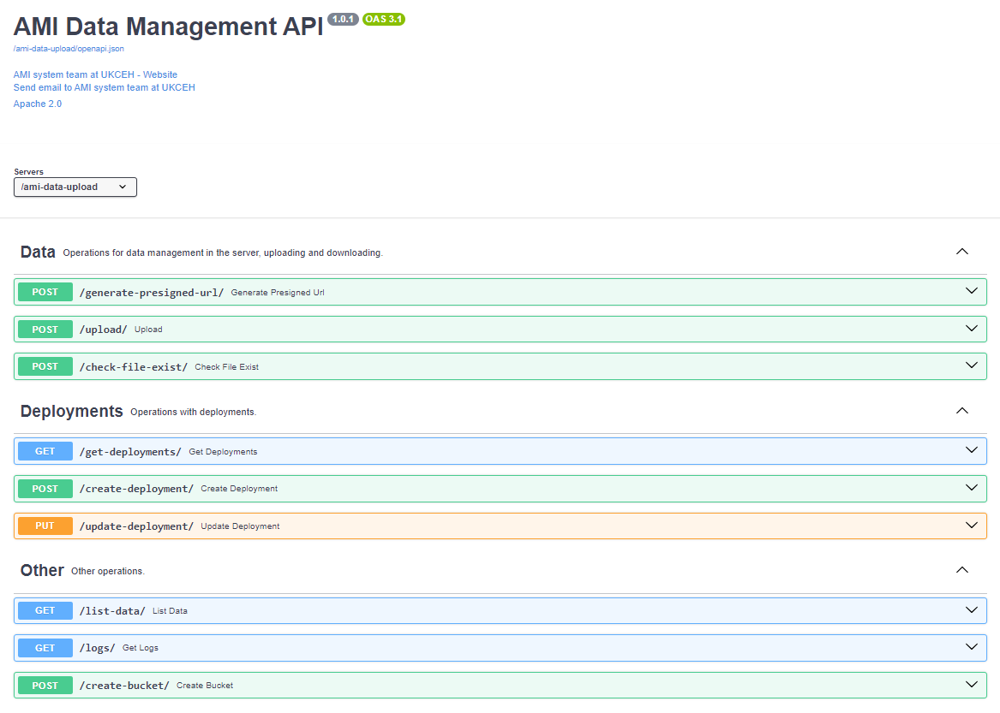

# AMI Data Management API

## Overview
This project provides an API to push data (images and audio files) into an S3 server. 
The API is built with FastAPI and includes endpoints for managing AMI system deployments and their data.

## Features
- Upload images and audio files to an S3 bucket.
- Manage deployment information.
- Automatically generated API documentation with Swagger UI and ReDoc.

## Installation

### Prerequisites
- Python 3.9+
- `conda` (optional, for creating a virtual environment)

### Steps

1. **Create a virtual environment:**
   ```sh
   conda create -n ami-api python=3.9
   conda activate ami-api
   ```

2. **Clone the repository:**
   ```sh
   git clone https://github.com/AMI-system/ami-api.git
   cd ami-api
   ```

3. **Install dependencies:**
   ```sh
   pip install -e .
   ```

4. **Create `credentials.json`:**
   Create a file named `credentials.json` in the root folder with the following content:
   ```json
   {
     "AWS_ACCESS_KEY_ID": "your_access_key_id",
     "AWS_SECRET_ACCESS_KEY": "your_secret_access_key",
     "AWS_REGION": "your_region",
     "AWS_URL_ENDPOINT": "your_endpoint"
   }
   ```

5. **Add `deployments_info.csv`:**
   Add the file named `deployments_info.csv` with the information about your AMI deployments.
   
## Running the Application locally
Start the application using Uvicorn:
```sh
uvicorn main:app --port 8080 --reload
```

## Using the Upload Page

### Accessing the Upload Page
Once the application is running, open your web browser and navigate to http://localhost:8080/. You will see a form that allows you to upload files.


### Uploading Files
1. **Fill in the form::** 
   - **Your Full Name:** Enter your full name.
   - **Country:** Select the country from the dropdown menu.
   - **Deployment:** Select the deployment from the dropdown menu.
   - **Data type:** Select the type of data (e.g., motion images, snapshot images, audible recordings, ultrasound recordings).
   - **Select Zip File:** Choose the zip file you want to upload, that contains images or audio files depending on the type of data that you are uploading.
   - **Review Data:** Check the box to acknowledge that you have reviewed the data.
  
  
2. **Upload the files::**
   - Click the ```Upload``` button to start the upload process.
   - A spinner will appear, and an alert will notify you not to close or refresh the page while uploading.
   - Once the upload is complete, a success message will be displayed.
  
  
## Endpoints

### Documentation
- **Swagger UI:** [http://localhost:8080/docs](http://localhost:8080/docs)
- **ReDoc:** [http://localhost:8080/redoc](http://localhost:8080/redoc)



### Data management
- **Upload Data:** Endpoint for pushing images and audio files to the server. The files need to be compressed in zip folder not bigger than 5Gbs. 
  ```http
  POST /upload/
  ```
  Form Data:
  - `name`: `string`
  - `country`: `string`
  - `deployment`: `string`
  - `data_type`: `string`
  - `file`: `.zip file`
  

### Deployments
- **Get Deployments:** Endpoint to retrieve all deployment information.
  ```http
  GET /get-deployments/
  ```

- **Create Deployment:** Endpoint to create a new deployment. 
  ```http
  POST /create-deployment/
  ```
  Body (JSON):
  ```json
  {
    "country": "Country Name",
    "country_code": "Country Code",
    "location_name": "Location Name",
    "lat": "Latitude",
    "lon": "Longitude",
    "camera_id": "Camera ID",
    "hardware_id": "Hardware ID",
    "status": "inactive"
  }
  ```
  
  
- **Update Deployment:** Endpoint to update a deployment information. 
  ```http
  PUT /update-deployment/
  ```
  Body (JSON):
  ```json
  {
    "country": "Country Name",
    "country_code": "Country Code",
    "location_name": "Location Name",
    "lat": "Latitude",
    "lon": "Longitude",
    "location_id": "Location ID",
    "camera_id": "Camera ID",
    "system_id": "System ID",
    "hardware_id": "Hardware ID",
    "deployment_id": "Deployment ID",
    "status": "inactive"
  }
  ```
  
  
### Other Operations
- **List Data:** Endpoint for retrieving the list of files available for a particular deployment. 
  ```http
  GET /list-data/
  ```
  Query Parameters:
  - `country_location_name`: `string` (format: "Country - Location Name")
  - `data_type`: `string` (one of "motion_images", "snapshot_images", "audible_recordings", "ultrasound_recordings")
  
  
- **Get Logs:** Endpoint for downloading the logs from a bucket in the S3 server. 
Everytime a user push some new data to the server, the log file is update with some information: 
date and time, username, country, deployment, data type and filename. 
  ```http
  GET /get-logs/
  ```
  Query Parameters:
  - `country_location_name`: `string` (format: "Country - Location Name")
  - `data_type`: `string` (one of "motion_images", "snapshot_images", "audible_recordings", "ultrasound_recordings")
  
  
- **Create Bucket:** Endpoint to create a new bucket in the S3 server. In our case, bucket are countries. 
  ```http
  POST /create-bucket/
  ```
  Body (JSON):
  ```json
  {
    "bucket_name": "your_bucket_name"
  }
  ```
  
## Python Scripts

This repository also contains additional Python scripts located in the `python_scripts` folder. Below are the details of each script and its purpose:

1. **s3_bucket_info.py**:
   - **Description**: This script is used for get information on what data is store in a particular bucket. You can filter 
   - **Usage**: 
     - Update the operation parameters with the bucket name (country name) and the prefix (deployment id) that you would like to check in this line of code:  
     ```operation_parameters = {'Bucket': '', 'Prefix': ''}```
     - Run the script on your terminal using this command:  
     ```python s3_bucket_info.py```

2. **s3_delete_objects.py**:
   - **Description**: This script handles deletes the content of a whole bucket or you can specify which deployment. Be very careful when you use it, it can't be undone.
   - **Usage**: 
     - Update the bucket name (country name) and the prefix (deployment id) that you would like to delete in this line of code:  
     ```bucket = s3.Bucket('')```  
     ```prefix = ""```  
     - Run the script on your terminal using this command:  
     ```python s3_delete_objects.py```

3. **s3_download.py**:
   - **Description**: This script allows you to download the data from a bucket, and you can also specify the deployment.
   - **Usage**: 
     - Update the bucket name (country name), the prefix (deployment id) and the folder where you would like to download the data in this line of code:  
     ```BUCKET_NAME = s3.Bucket('')```  
     ```PREFIX = ""```  
     ```LOCAL_DOWNLOAD_PATH = r"/path/to/local/folder"```
     - Run the script on your terminal using this command:  
     ```python s3_download.py```
  

## Contributing
Feel free to fork this repository and create a pull request. For major changes, please open an issue first to discuss what you would like to change.


## License
This project is licensed under the Apache 2.0 License.


## Contact
For more information, visit [UKCEH AMI System](https://www.ceh.ac.uk/solutions/equipment/automated-monitoring-insects-trap) or contact the team at [ami-system@ceh.ac.uk](mailto:ami-system@ceh.ac.uk).
